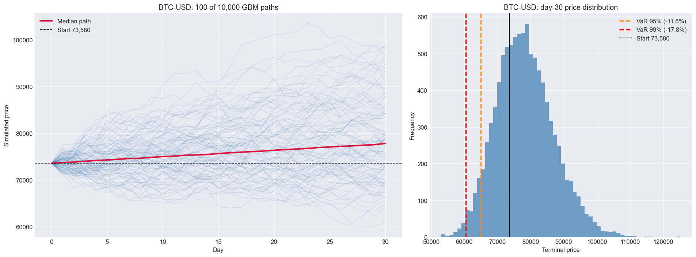
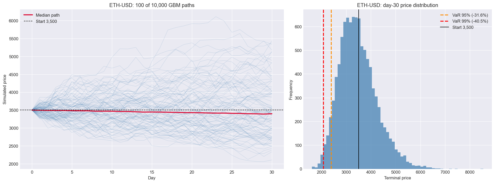

# Hybrydowy Model Krypto (Crypto Hybrid Model)

Trójwarstwowy framework badawczo-analityczny dla walut Bitcoin (BTC) i Ethereum (ETH), który łączy klasyczną ekonometrię statystyczną (GARCH) z zaawansowanym uczeniem maszynowym (XGBoost) oraz probabilistycznymi symulacjami ryzyka (Monte Carlo). Framework służy do prognozowania dziennych zwrotów rynkowych oraz zarządzania kapitałem za pomocą strategii typu *Long/Flat* (w rynku lub w gotówce).

---

## Intuicja projektu

Przewidywanie, czy cena Bitcoina jutro wzrośnie, czy spadnie, jest niesamowicie trudne i przypomina rzut monetą – rynek jest pełen szumu. Istnieje jednak pewna prawidłowość: **ryzyko (zmienność) na rynku finansowym lubi się kumulować**. Jeśli dzisiaj na giełdzie dzieje się coś gwałtownego, istnieje ogromne prawdopodobieństwo, że jutro również zobaczymy potężne wahania.

Ten model nie próbuje rozpaczliwie odgadnąć przyszłej ceny. Jego zadaniem jest **zrozumieć reżim ryzyka**: uczy się, kiedy na rynku panuje sztorm, a kiedy spokój, i na tej podstawie decyduje, czy bezpieczniej jest inwestować (Long), czy przeczekać kryzys w gotówce (Flat).

---

##  Architektura Systemu i Przepływ Danych

System został zaprojektowany w sposób całkowicie modułowy, izolując od siebie pobieranie danych, matematykę statystyczną, algorytmy sztucznej inteligencji oraz symulację przyszłości.

```text
[ WARSTWA 0: DANE ]
Pobieranie surowych notowań OHLCV z Yahoo Finance (yfinance) -> Obliczanie log-zwrotów
│
▼
[ WARSTWA 1: STATYSTYKA ]
Test stacjonarności ADF -> Dopasowanie modelu GARCH(1,1) -> Wygenerowanie cechy zmienności (σ)
│
▼
[ WARSTWA 2: UCZENIE MASZYNOWE ]
Inżynieria cech (Lags, RSI, SMA) -> Trening XGBoost -> Walidacja czasowa (TimeSeriesSplit)
│
▼
[ WARSTWA 3: ZARZĄDZANIE RYZYKIEM ]
Zwektoryzowany Ruch Browna (Monte Carlo) -> Kalkulacja VaR/CVaR -> Kryterium Kelly'ego / Sharpe'a
```

---

##  Warstwa 1: Statystyka i Podwaliny Ekonometryczne

Zanim dane trafią do algorytmów sztucznej inteligencji, poddawane są rygorystycznej obróbce statystycznej. Pozwala to na dostarczenie modelowi ML cech o najwyższej wartości informacyjnej.

### 1. Log-zwroty (Log-Returns)

W analizie finansowej rzadko operuje się na surowych cenach. Zmian procentowych nie da się łatwo sumować, dlatego model oblicza logarytmiczne zwroty z cen zamknięcia według wzoru:

$$
r_t = \ln\left(\frac{P_t}{P_{t-1}}\right)
$$

Gdzie \(P_t\) to cena w dniu dzisiejszym, a \(P_{t-1}\) to cena z dnia poprzedniego.

- **Dlaczego to robimy?** Log-zwroty mają doskonałe właściwości matematyczne – przede wszystkim są addytywne w czasie. Oznacza to, że suma log-zwrotów z kilku kolejnych dni daje dokładnie log-zwrot z całego tego okresu.

### 2. Test Stacjonarności ADF (Augmented Dickey-Fuller)

Większość modeli statystycznych i uczenia maszynowego wymaga, aby dane wejściowe były stacjonarne (czyli by ich średnia i wariancja nie zmieniały się drastycznie w czasie). Test ADF sprawdza hipotezę zerową mówiącą o tym, że szereg czasowy posiada pierwiastek jednostkowy (jest niestacjonarny). Niski wskaźnik p-value pozwala odrzucić tę hipotezę i uznać zwroty za stacjonarne, co uzasadnia ich dalsze procesowanie.

### 3. Model GARCH(1,1) – Dynamiczna Analiza Ryzyka

Model GARCH (Generalized Autoregressive Conditional Heteroskedasticity) służy do prognozowania zmiennej w czasie wariancji (czyli dynamicznego ryzyka). Klasyczny model GARCH(1,1) opisuje warunkową wariancję \(\sigma_t^2\) równaniem:

$$
\sigma_t^2 = \omega + \alpha \varepsilon_{t-1}^2 + \beta \sigma_{t-1}^2
$$

- \(\omega\) – stały poziom wariancji (szum bazowy),
- \(\alpha \varepsilon_{t-1}^2\) – wpływ wczorajszego szoku cenowego (gwałtownej informacji z rynku),
- \(\beta \sigma_{t-1}^2\) – wpływ wczorajszego poziomu zmienności (efekt pamięci rynkowej).

Wygenerowana w ten sposób prognoza zmienności dziennej przekształcana jest na wartość roczną (annualizowaną) z uwzględnieniem faktu, że rynki kryptowalut działają bez przerwy (365 dni w roku):

$$
\sigma_{\mathrm{roczna}} = \sigma_{\mathrm{dziennie}} \times \sqrt{365}
$$

Wartość ta zasila model uczenia maszynowego jako kluczowa cecha opisująca bieżący poziom strachu/chciwości na rynku oraz stanowi parametr wejściowy do symulacji ryzyka.

---

##  Warstwa 2: Uczenie Maszynowe 

Warstwa uczenia maszynowego odpowiada za syntezę wszystkich danych rynkowych i próbę prognozy siły ruchu ceny na kolejny dzień.

### Sformułowanie problemu: Regresja zamiast Klasyfikacji

Projekt podchodzi do problemu w sposób ciągły. Nie klasyfikujemy ruchu jako proste „góra/dół” (0 lub 1). Model rozwiązuje zadanie regresji – uczy się przewidywać dokładną wartość liczbową (prognozowany log-zwrot następnego dnia). Dopiero w kolejnym kroku, na podstawie optymalizacji matematycznej pod kątem wskaźnika Sortino, dopasowywany jest próg decyzyjny aktywujący pozycję na rynku.

### Inżynieria Cech (Feature Engineering) – Co widzi model?

Algorytmy drzewiaste nie potrafią ekstrapolować danych poza zakres, który widziały podczas treningu. Podanie im surowej ceny Bitcoina sprawiłoby, że model stałby się bezużyteczny po przebiciu historycznych maksimów. Dlatego wszystkie cechy transformowane są do postaci relatywnej i stacjonarnej:

| Grupa cech | Opis mechanizmu | Rola w modelu |
|---|---|---|
| Opóźnienia (Lags 1-7d) | Historyczne log-zwroty z ostatnich 7 dni. | Badanie krótkoterminowej autokorelacji i pędu. |
| Stosunki SMA | Relacja bieżącej ceny do jej średnich kroczących (np. SMA 7 do SMA 21). | Identyfikacja trendu bez podawania nominalnej ceny. |
| RSI-14 | Wskaźnik siły relatywnej (Relative Strength Index). | Wykrywanie poziomów wykupienia i wyprzedania rynku. |
| Zmienność GARCH | Dynamiczna, warunkowa zmienność wyliczona w Warstwie 1. | Dostarczanie czystej informacji o aktualnym reżimie ryzyka. |
| Dynamika Wolumenu | Procentowe zmiany oraz stosunki wolumenu obrotu. | Potwierdzenie istotności ruchów cenowych przez kapitał. |

### Jak działa algorytm XGBoost?

XGBoost (Extreme Gradient Boosting) to jeden z najpotężniejszych algorytmów uczenia maszynowego dla danych tabelarycznych. Należy on do rodziny metod zespołowych (Ensemble Learning) i opiera się na koncepcji wzmacniania gradientowego (Gradient Boosting).

####  Intuicja obrazowa: Sztafeta Ekspertów

Wyobraź sobie, że grupa ekspertów próbuje wspólnie rozwiązać trudne zadanie matematyczne:

1. **Pierwsze drzewo decyzyjne (Ekspert nr 1)** buduje bardzo prostą regułę, np.: „Jeśli RSI < 30, to jutrzejszy zwrot wyniesie +0.5%”. Popełnia przy tym ogromny błąd (tzw. residuum), ponieważ rynek jest skomplikowany.
2. **Drugie drzewo decyzyjne (Ekspert nr 2)** nie próbuje przewidzieć zwrotu od nowa. Jego jedynym zadaniem jest przewidzieć błąd popełniony przez Eksperta nr 1 i go skorygować.
3. **Trzecie drzewo (Ekspert nr 3)** uczy się przewidywać błąd pozostałej dwójki.

Każde kolejne drzewo jest celowo trenowane na porażkach swoich poprzedników. Końcowa prognoza to suma składowych wszystkich drzew, gdzie każde kolejne koryguje niedociągnięcia poprzednich.

```text
[Surowe Dane] ──> (Drzewo 1: Prognoza bazowa) ──> Obliczenie Błędu (Residuum)
│
▼
(Drzewo 2: Przewiduje Błąd Drzewa 1)
│
▼
(Drzewo 3: Przewiduje Błąd Drzewa 2)
│
▼
[Ostateczny Wynik] <── Suma ważona wszystkich korekt punktowych
```

###  Dlaczego XGBoost, a nie sieci neuronowe (np. LSTM)?

- **Odporność na przeuczenie (Regularization):** XGBoost posiada wbudowaną penalizację za tworzenie zbyt skomplikowanych drzew (parametry L1 i L2). Zapobiega to dopasowywaniu się modelu do czystego szumu rynkowego.
- **Geometria podziału przestrzeni:** Drzewa decyzyjne świetnie radzą sobie z nieliniowymi zależnościami interakcji cech (np. „jeśli RSI > 70 ORAZ zmienność GARCH jest ekstremalnie wysoka, to wyjdź z rynku”).
- **Wielkość zbioru danych:** Przy dziennych danych historycznych dysponujemy kilkoma tysiącami próbek. Dla głębokich sieci neuronowych to zbyt mało, natomiast dla XGBoost jest to wolumen optymalny.

### Strażnicy Poprawności Metodologicznej: Chronologia Chroniona

W prognozowaniu finansowym najłatwiej o błąd zwany wyciekiem danych (Data Leakage). Jeśli model przypadkowo pozna chociażby ułamek informacji z przyszłości, wyniki testów będą genialne, a system na żywo straci kapitał. W projekcie zaimplementowano dwa mechanizmy obronne:

#### 1. TimeSeriesSplit

Klasyczna walidacja krzyżowa (K-Fold) losowo dzieli dane, co w szeregach czasowych łamie chronologię. Stosujemy podział kroczący z zachowaniem kierunku czasu:

```text
Fold 1: [ Trening: Rok 2021 ] ──> [ Test: Rok 2022 ]
Fold 2: [ Trening: Rok 2021-2022 ] ──> [ Test: Rok 2023 ]
Fold 3: [ Trening: Rok 2021-2023 ] ──> [ Test: Rok 2024 ]
```

#### 2. Kalibracja Walk-Forward

Model ML generuje surową prognozę zwrotu. Moduł `backtest.py` szuka optymalnego progu odcięcia (np. aktywuj pozycję Long tylko wtedy, gdy prognoza przekracza wyliczoną barierę), minimalizując ryzyko fałszywych sygnałów. Optymalizacja ta odbywa się wyłącznie na danych historycznych (in-sample) względem danego okna testowego, symulując rzeczywiste warunki handlu.

---

##  Warstwa 3: Zarządzanie Ryzykiem i Symulacje Monte Carlo

Ostatnia warstwa odpowiada za propagację niepewności w przód. Wykorzystując prognozy z poprzednich kroków, silnik uruchamia 10 000 niezależnych symulacji rozwoju ceny na najbliższe 30 dni.

### Geometryczny Ruch Browna (GBM)

Ścieżki cenowe generowane są za pomocą stochastycznego równania różniczkowego w postaci zdyskretyzowanej (krok dzienny):

$$
S_t = S_0 \exp\left[\left(\mu - \frac{\sigma^2}{2}\right)\Delta t + \sigma\sqrt{\Delta t}\, Z\right]
$$

- \(S_0\) – ostatnia znana cena rzeczywista (punkt startowy),
- \(\mu\) – dryf rynkowy pobrany bezpośrednio z prognozy modelu XGBoost (roczny oczekiwany zwrot),
- \(\sigma\) – zmienność warunkowa pobrana z modelu GARCH(1,1),
- \(\Delta t\) – krok czasowy (\(1/365\)),
- \(Z\) – losowa zmienna o rozkładzie standardowym normalnym \(\mathcal{N}(0,1)\) odpowiedzialna za generowanie 10 000 wariantów.

### Miary Ryzyka Ogona (Tail Risk)

Z końcowego rozkładu symulowanych cen wyliczane są kluczowe wskaźniki dla zarządzania ryzykiem:

- **Value at Risk (VaR 95% / 99%):** Maksymalna oczekiwana strata, jakiej można się spodziewać w horyzoncie 30 dni z prawdopodobieństwem odpowiednio 95% lub 99%.
- **Conditional Value at Risk (CVaR / Expected Shortfall):** Średnia strata w najgorszych 5% lub 1% scenariuszy (pokazuje głębokość zapaści kapitału po przekroczeniu bariery VaR).

---

##  Wykresy i Symulacje

W oparciu o parametry wejściowe, model generuje trajektorie cenowe oraz histogramy rozkładu ryzyka końcowego.

### Bitcoin (BTC-USD)



### Ethereum (ETH-USD)



---

##  Szybki Start

### 1. Przygotowanie środowiska i instalacja

Projekt wymaga Pythona w wersji 3.10 lub nowszej.

```powershell
python -m venv venv
.\venv\Scripts\Activate.ps1   # Windows PowerShell
# source venv/bin/activate    # Linux / macOS
pip install -r requirements.txt
```

### 2. Wykonanie rurociągu badawczego

```powershell
# Pełny pipeline (konsola + zapis wykresów PNG do plików)
python main.py

# Pokazywanie okien wykresów matplotlib (wymaga ich zamykania w celu kontynuacji)
python main.py --show-plots
```

---

##  Jak czytać wyniki z terminala? 

Po uruchomieniu skryptu `python main.py` system generuje raport podzielony na sekcje. Rynek finansowy to w dużej mierze szum, dlatego nasz model nie stara się być nieomylnym jasnowidzem – jego głównym zadaniem jest roztropne zarządzanie ryzykiem.

Oto jak bez bólów głowy zinterpretować to, co wyświetla konsola:

---

### 1. Metryki Sztucznej Inteligencji (Layer 2 ML Forecasting Metrics)

W tej sekcji algorytm XGBoost podsumowuje swoje próby przewidywania jutra na 5 różnych odcinkach czasu (tzw. foldach chronologicznych).

* **Ujemne $R^2$ (np. -0.27):** > **Co to oznacza dla człowieka:** Model częściowo gubi się w rynkowym szumie i popełnia błędy. 
    W świecie finansów na danych dziennych to **całkowicie normalne**. Gdyby model na niezależnych danych miał $R^2$ na poziomie +80%, oznaczałoby to, że w kodzie jest błąd (wyciek danych z przyszłości). Nasz ujemny wynik to dowód na to, że test jest rygorystyczny i uczciwy.
* **Trafność kierunkowa (`dir_acc` ~ 49-51%):** > **Co to oznacza dla człowieka:** Algorytm zgaduje kierunek ruchu ceny (góra/dół) z dokładnością zbliżoną do rzutu monetą. 
    Potwierdza to rynkową zasadę: nikt nie wie, co stanie się jutro. Nasza strategia nie wygrywa dlatego, że idealnie zgaduje przyszłość, ale dlatego, że potrafi w odpowiednim momencie **uciec z giełdy**.
* **Ważność cech (Feature Importances):**
    Pokazuje, co dla bota jest najważniejsze. Zobaczysz tam, że najwyższe noty zbiera zmienność (`rolling_vol`, `garch_vol`). Oznacza to, że algorytm opiera swoje decyzje na **poziomie strachu i ryzyka na rynku**, a nie na ślepym podążaniu za ceną.

---

### 2. Wyniki Strategii Inwestycyjnej (Walk-Forward Validated Strategy)

To najważniejsza tabela w całym projekcie. Porównuje ona dwa podejścia:
1.  **Benchmark (Buy & Hold):** Czyli tradycyjne, pasywne kupienie kryptowaluty i trzymanie jej bez względu na wszystko.
2.  **Strategy:** Nasz inteligentny bot, który na podstawie wskazań ML decyduje: inwestujemy (**Long**) czy czekamy w bezpiecznej gotówce (**Flat**).

#### Kluczowe pojęcia w tabeli:
* **Sharpe / Sortino Ratio:** Im wyższe, tym lepszy stosunek zysku do strachu. Wskaźnik *Sortino* jest kluczowy, bo ocenia model wyłącznie za straty (nie karze go za to, że cena nagle wystrzeliła w górę).
* **Max Drawdown (Maksymalne obsunięcie):** Najważniejsza miara ryzyka. Pokazuje, jak głęboko spadłby Twój kapitał w najgorszym momencie kryzysu.

---

### 3. Trzy Werdykty Inwestycyjne (Jak system ocenia samego siebie)

Po przeanalizowaniu danych system automatycznie wystawia jedną z trzech ocen:

####  PEŁNA PRZEWAGA
* **W skrócie:** Bot idealny. Zarobił więcej niż zwykłe trzymanie krypto, a do tego zrobił to przy mniejszym ryzyku i mniejszych spadkach.

####  DEFENSYWNA PRZEWAGA (Przykład Bitcoina w Twoim teście)
* **W skrócie:** Bot jako tarcza ochronna.
* **Jak to czytać:** Zwykłe trzymanie Bitcoina dało np. +58% zysku, ale w trakcie roku Twój kapitał topniał w kryzysie aż o **-66%** (`max_drawdown`). Nasz bot zarobił skromne +2%, ale jego największy spadek wyniósł zaledwie **-22%**. 
* **Werdykt:** Algorytm uznał rynek za zbyt niebezpieczny i przez większość czasu kazał Ci siedzieć na bezpiecznej gotówce. Uciąłeś zysk, ale uratowałeś nerwy i 44% swojego kapitału przed potężnym krachem.

####  BRAK PRZEWAGI (Przykład Ethereum w Twoim teście)
* **W skrócie:** Rynek okazał się sprytniejszy od bota.
* **Jak to czytać:** Bot zanotował gorszy wynik lub głębszy spadek niż zwykłe trzymanie kryptowaluty. 
* **Werdykt:** W przypadku Ethereum rynek mocno szarpał w górę i w dół (konsolidacja). Bot za często kupował na górce i sprzedawał w dołku, a koszty transakcyjne (prowizje giełdowe ustawione rygorystycznie na 10 punktów bazowych) dodatkowo pogłębiły stratę. To dowód na to, że model nie jest sztucznie podkręcony pod ładne wyniki.

---

###  4. Prognoza Ryzyka (Layer 3 Monte Carlo Analytics)

Na samym dole raportu silnik probabilistyczny łączy prognozę kierunku z AI oraz poziom strachu z modelu GARCH, po czym symuluje **10 000 możliwych scenariuszy na kolejne 30 dni**.

* **Value at Risk (VaR 95%):** Jeśli wynosi np. `-3.37%`, daje inwestorowi jasny komunikat: *Based on current math, there is only a 5% chance that tomorrow we will lose more than 3.37% of our money.*
* **Expected Shortfall (CVaR 95%):** Odpowiada na pytanie: *Gdyby jednak wydarzył się ten najgorszy scenariusz (czarna łabędź), to jak głęboka będzie średnia strata w tej strefie katastrofy?*
- **PEŁNA PRZEWAGA:** Strategia handlowa pokonuje benchmark pasywny (Buy & Hold) zarówno pod kątem zwrotu, jak i metryk skorygowanych o ryzyko.
- **DEFENSYWNA PRZEWAGA:** Algorytm dostarcza mniejszych obsunięć kapitału (Max Drawdown) i ma lepsze wskaźniki Sharpe/Sortino, lecz wygenerował mniejszy całkowity zysk (profil: bezpieczniej, ale mniej zyskownie).
- **BRAK PRZEWAGI:** Wyniki strategii są gorsze od standardowego trzymania kryptowaluty.

